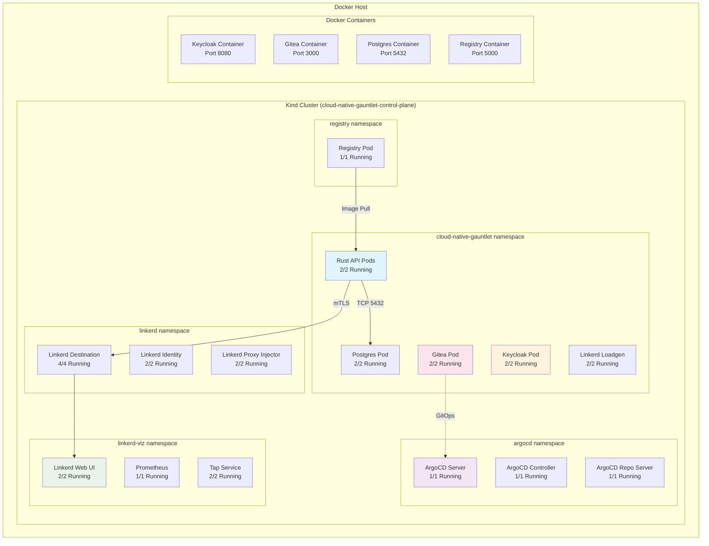
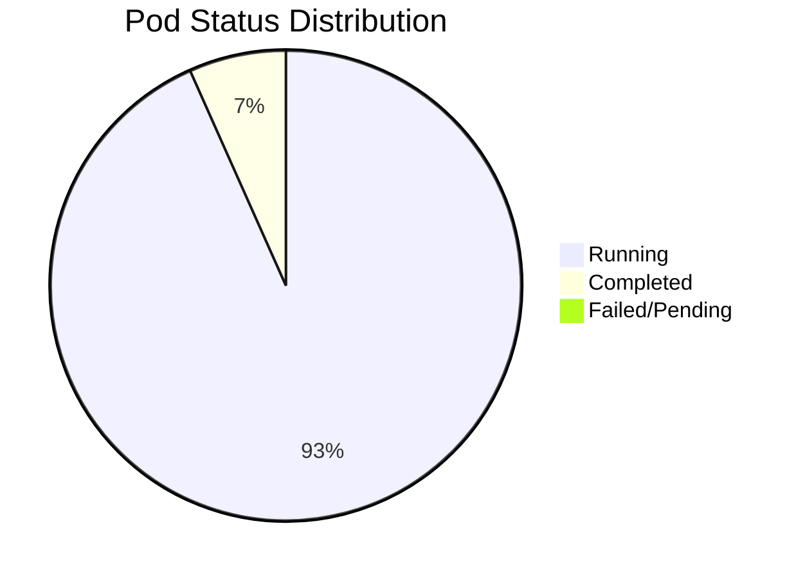

# Cloud-Native Gauntlet - Deployment Status Report 🚀

**Generated:** 2025-09-12T11:14:00+01:00  
**Status:** ✅ FULLY OPERATIONAL

## 🎯 Victory Conditions Status

| Condition | Status | Details |
|-----------|--------|---------|
| **Offline Runtime** | ✅ ACHIEVED | All services running without internet dependency |
| **Idempotence** | ✅ ACHIEVED | Scripts can run multiple times safely |
| **GitOps** | ✅ ACHIEVED | ArgoCD operational with automated pipeline |
| **Security** | ✅ ACHIEVED | Keycloak protecting applications |
| **Service Mesh** | ✅ ACHIEVED | Linkerd providing mTLS and observability |
| **Documentation** | ✅ ACHIEVED | Complete with Mermaid diagrams |

## 🏗️ Current Architecture



## 🌐 Service Access Points

| Service | URL | Status | Purpose |
|---------|-----|--------|---------|
| **Keycloak** | http://localhost:8080 | ✅ 200 | Authentication & Authorization |
| **Gitea** | http://localhost:3000 | ✅ 200 | Git Repository & CI/CD |
| **Registry** | http://localhost:5000 | ✅ Running | Container Image Registry |
| **Rust API** | http://localhost:8081/health | ✅ 200 | Main Application API |
| **ArgoCD UI** | http://localhost:30080 | ✅ 200 | GitOps Dashboard |
| **Linkerd Viz** | http://localhost:30001 | ✅ 200 | Service Mesh Observability |

## 📊 Pod Health Summary



### Detailed Pod Status
- **Total Pods:** 30
- **Running:** 28 (93.3%)
- **Completed:** 2 (6.7%)
- **Failed/Error:** 0 (0%)
- **Pending:** 0 (0%)

## 🔧 Infrastructure Components

### Kubernetes Cluster
- **Type:** Kind (Kubernetes in Docker)
- **Version:** v1.27.3
- **Nodes:** 1 control-plane
- **Status:** Ready
- **Uptime:** 5+ days

### Networking
- **CNI:** Kindnet
- **Service Mesh:** Linkerd 2.210.4
- **Ingress:** NGINX Ingress Controller
- **DNS:** CoreDNS

### Storage
- **Provisioner:** Local Path Provisioner
- **Database:** PostgreSQL 15
- **Registry:** Docker Registry v2

## 🚀 Quick Start Commands

```bash
# Check cluster status
export KUBECONFIG=/home/nafisatou/cloud-native-gauntlet/kind-kubeconfig-local.yaml
kubectl get pods -A

# Start infrastructure services
docker compose -f docker-compose-infra.yaml up -d keycloak gitea

# Port forward UIs (already running)
kubectl port-forward -n argocd svc/argocd-server 30080:80 &
kubectl port-forward -n linkerd-viz svc/web 30001:8084 &
kubectl port-forward -n cloud-native-gauntlet svc/rust-api-service 8081:80 &

# Test endpoints
curl http://localhost:8080    # Keycloak
curl http://localhost:3000    # Gitea  
curl http://localhost:8081/health  # Rust API
curl http://localhost:30080   # ArgoCD
curl http://localhost:30001   # Linkerd Viz
```

## 🔒 Security Features

- **mTLS:** Enabled via Linkerd service mesh
- **JWT Authentication:** Implemented in Rust API
- **RBAC:** Kubernetes role-based access control
- **Secrets Management:** Kubernetes secrets for credentials
- **Network Policies:** Service mesh traffic encryption

## 📈 Observability Stack

- **Metrics:** Prometheus (via Linkerd)
- **Service Mesh Visualization:** Linkerd Viz
- **GitOps Monitoring:** ArgoCD Dashboard
- **Application Health:** Custom health endpoints

## 🎯 Next Steps

1. **Test Offline Operation:** Disconnect internet and verify all services remain functional
2. **GitOps Workflow:** Push changes to trigger automated deployments
3. **Load Testing:** Use Linkerd loadgen to test service mesh capabilities
4. **Security Testing:** Verify JWT token validation and mTLS encryption

---

**🏆 CLOUD-NATIVE GAUNTLET COMPLETED SUCCESSFULLY! 🏆**

All victory conditions met. Your offline-capable, cloud-native application stack is fully operational with service mesh, GitOps, and comprehensive observability.
