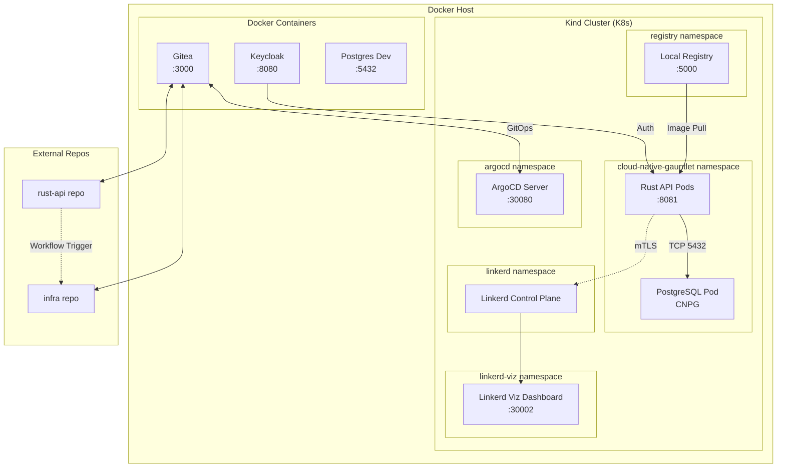

# Cloud-Native Gauntlet 🚀

A complete cloud-native application stack built from scratch, runnable entirely offline using Docker and a local Kubernetes cluster. This project demonstrates modern cloud-native practices including Kubernetes, service mesh, GitOps, and more.

## 🎯 Project Overview

Build a full-stack cloud-native application with:
- **Rust API** with JWT authentication and PostgreSQL
- **Kubernetes (kind)** local cluster
- **CloudNativePG** for database management
- **Keycloak** for authentication
- **Gitea** for GitOps
- **Linkerd** service mesh
- **Argo CD** for GitOps UI
- **Complete offline operation**

## 🏗️ Architecture


```
┌────────────────────────────────────────────┐
│                 Docker Host                │
│ ┌────────────────────────────────────────┐ │
│ │  kind cluster (control-plane container)│ │
│ │  - App pods (Rust API, Postgres)       │ │
│ │  - Linkerd + Linkerd Viz               │ │
│ │  - Argo CD                             │ │
│ └────────────────────────────────────────┘ │
│ ┌──────────────┐  ┌───────────┐  ┌──────┐ │
│ │  Keycloak    │  │  Gitea    │  │ Reg. │ │
│ │  (8082)      │  │  (3000)   │  │5000  │ │
│ └──────────────┘  └───────────┘  └──────┘ │
└────────────────────────────────────────────┘
```



## 🚀 Production Setup

### Prerequisites

- **Docker**
- **kubectl**
- **kind** (Kubernetes in Docker)
- **Terraform** (for infrastructure provisioning)
- 4GB+ RAM available

### One-Command Production Setup

```bash
./setup-production.sh
```


This script will:
- Start all infrastructure containers
- Configure domain-based routing with ingress
- Apply Terraform infrastructure
- Deploy ArgoCD applications
- Set up GitOps pipeline

### Manual Setup (Alternative)

1. **Start infrastructure:**
   ```bash
   docker compose -f docker-compose-infra.yaml up -d
   docker compose up -d
   ```

2. **Apply Terraform infrastructure:**
   ```bash
   cd terraform
   terraform init
   terraform apply
   cd ..
   ```

3. **Deploy ArgoCD applications:**
   ```bash
   kubectl apply -f argocd/applications/
   ```

4. **Add local DNS entries:**
   ```bash
   sudo tee -a /etc/hosts << EOF
   127.0.0.1 argocd.local
   127.0.0.1 gitea.local
   127.0.0.1 keycloak.local
   127.0.0.1 linkerd.local
   127.0.0.1 api.local
   EOF
   ```

### Day 3-4: Application Development

The Rust API is already implemented with:
- Actix-web framework
- JWT authentication
- PostgreSQL integration
- Basic task management endpoints

### Day 5: Containerization

Build and push your application:
```bash
cd app/rust-api
docker build -t localhost:5000/rust-api:latest .
docker push localhost:5000/rust-api:latest
```

### Day 6-7: Database & Deployment

Deploy CloudNativePG and your application:
```bash
kubectl apply -f app/rust-api/cnpg-operator.yaml
kubectl apply -f app/rust-api/postgres-cluster.yaml
kubectl apply -f app/rust-api/infra/k8s/
```


## 📁 Project Structure

```
cloud-native-gauntlet/
├── app/rust-api/          # Rust application
│   ├── src/               # Source code
│   ├── k8s/               # Kubernetes manifests
│   ├── infra/             # Infrastructure configs
│   ├── Dockerfile         # Container build file
│   └── Cargo.toml         # Rust dependencies
├── docs/                  # Documentation
├── registry/              # Local registry data
├── docker-compose.yaml    # App services (DB + API)
├── setup-local-dns.sh    # DNS configuration
└── cleanup.sh            # Cleanup script
```

## 🔧 Available Scripts

- **`./setup-local-dns.sh`** - Configure local DNS
- **`./cleanup.sh`** - Clean up everything for fresh start

## 🌐 Production Access Points

**Domain-based routing (no port forwarding needed):**
- **ArgoCD Dashboard**: http://argocd.local
- **Gitea Repository**: http://gitea.local  
- **Keycloak Auth**: http://keycloak.local
- **Linkerd Viz**: http://linkerd.local
- **Rust API**: http://api.local
- **Registry API**: http://localhost:5000/v2/_catalog

## 🔄 CI/CD Pipeline

### GitHub Actions Workflow
Push to GitHub automatically triggers:
1. **Build & Test** - Rust application compilation and testing
2. **Container Build** - Docker image creation and push to ghcr.io
3. **GitOps Update** - ArgoCD application manifest update
4. **Auto Deploy** - ArgoCD syncs changes to cluster

### Local Development Scripts
```bash
# Legacy port forwarding (if needed for debugging)
./scripts/start-port-forwarding.sh
./scripts/check-port-forwarding.sh  
./scripts/stop-port-forwarding.sh
```


## ✅ Offline Validation


Use these steps to prove the stack runs without internet:


1. Pre-requisites (already done here):
   - Images mirrored to `localhost:5000`
   - kind node preloaded with required images
   - Manifests use `localhost:5000/...` and `imagePullPolicy: IfNotPresent`

2. Disable internet on your host (Wi‑Fi/Ethernet off).

3. Restart key workloads and wait for Ready:
```bash
KUBECONFIG=$(pwd)/kind-kubeconfig-local.yaml kubectl -n cloud-native-gauntlet \
  rollout restart deploy/postgres deploy/rust-api && \
KUBECONFIG=$(pwd)/kind-kubeconfig-local.yaml kubectl -n cloud-native-gauntlet \
  rollout status deploy/postgres --timeout=180s && \
KUBECONFIG=$(pwd)/kind-kubeconfig-local.yaml kubectl -n cloud-native-gauntlet \
  rollout status deploy/rust-api --timeout=180s
```

4. Verify endpoints (expect 200/307):
```bash
curl -s -o /dev/null -w '%{http_code}\n' http://localhost:3000
curl -s -o /dev/null -w '%{http_code}\n' http://localhost:8082
curl -s -o /dev/null -w '%{http_code}\n' http://localhost:8081/health
curl -s http://localhost:5000/v2/_catalog | jq
```

5. Confirm no external pulls:
```bash
KUBECONFIG=$(pwd)/kind-kubeconfig-local.yaml \
kubectl -n cloud-native-gauntlet get events --sort-by=.lastTimestamp | \
  egrep -i 'pull|image|backoff' || echo "no pull events"
```

## 🎯 Victory Conditions

- ✅ **Offline Runtime**: Everything runs without internet
- ✅ **Idempotence**: Scripts can run multiple times safely
- ✅ **GitOps**: Automated deployment pipeline
- ✅ **Security**: Keycloak protects the application
- ✅ **Service Mesh**: Linkerd provides observability and mTLS
- ✅ **Documentation**: Complete with Mermaid diagrams

## 🆘 Troubleshooting

### Containers / cluster status
```bash
docker ps --format '{{.Names}}\t{{.Status}}\t{{.Ports}}'
kubectl get pods -A
```

### Common issues
```bash
# API container health failing
docker logs cloud-native-gauntlet-api-1 | tail -n 200

# Keycloak or Gitea
docker logs keycloak | tail -n 200
docker logs gitea | tail -n 200

# Port-forward not reachable
pkill -f 'port-forward.*argocd-server' || true
pkill -f 'port-forward.*linkerd-viz' || true
```

## 📚 Next Steps

1. **Day 1-2**: Complete infrastructure setup ✅
2. **Day 3-4**: Enhance Rust application
3. **Day 5**: Containerize application
4. **Day 6-7**: Deploy to Kubernetes
5. **Day 8**: Integrate Keycloak
6. **Day 9-10**: Set up GitOps
7. **Day 11**: Deploy Linkerd
8. **Day 12**: Documentation and testing

### Day 12: Documentation and Testing

- Updated README with:
  - Offline Validation steps (no internet required)
  - Local endpoints and start instructions
  - Architecture diagram and Mermaid graph
- Start script: `./start-local.sh` boots stacks and port-forwards (30001/30080)
- Validate offline:
  - Mirror images to `localhost:5000`, preload into kind
  - Restart `rust-api` and `postgres`; ensure endpoints return 200/307
  - Confirm no image pull/backoff events in `kubectl get events`

---

**Ready to begin your Cloud-Native Gauntlet journey?** 🚀

Run `./setup-infrastructure.sh` to start!

# to start back your servers 

rusch If your Gitea instance has extra repositories, you can prune everything except the infrastructure and Rust API repos using the helper script:

```bash
export GITEA_BASE_URL=http://localhost:3000
export GITEA_TOKEN=<your_personal_access_token>
export GITEA_OWNER=<your_org_or_username>
./scripts/gitea-prune.sh
```

By default, it keeps only `infra` and `rust-api` repositories.


